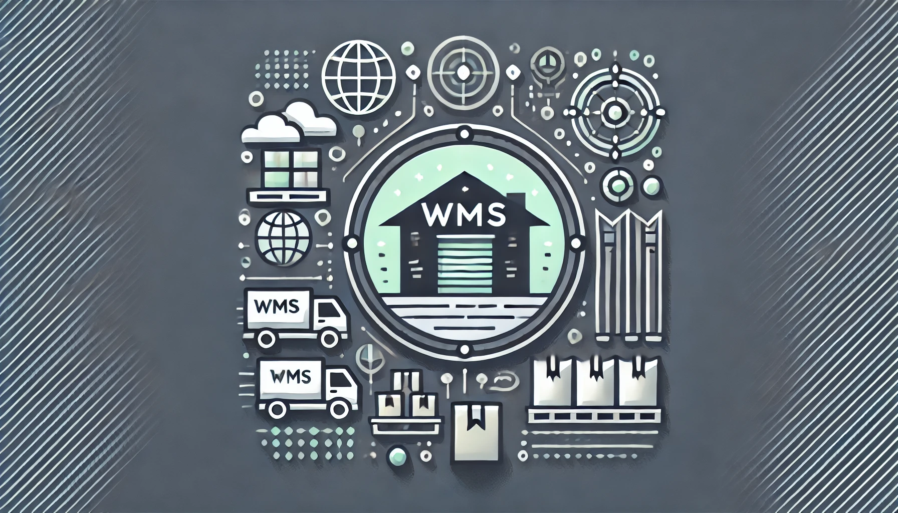
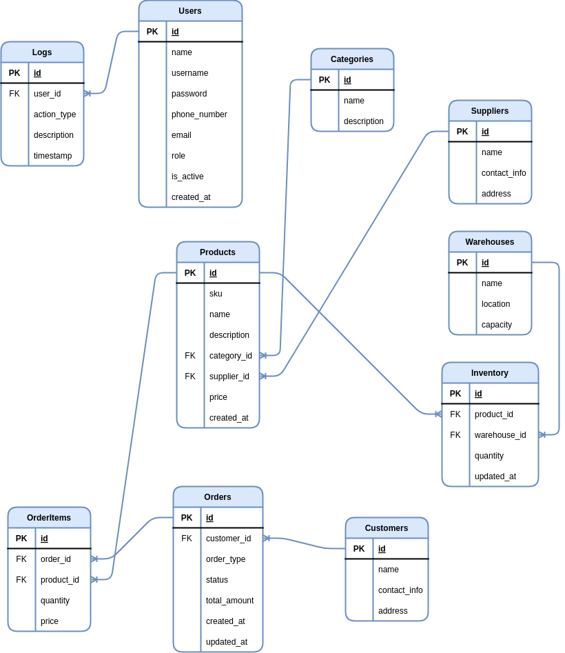

# Warehouse Management System (WMS)



The Warehouse Management System (WMS) is a robust, role-based application built using Django. It streamlines warehouse operations, allowing organizations to manage their inventory, orders, and transactions efficiently. The system supports inbound and outbound transactions, order management, and role-based permissions for seamless and secure usage.

## Technologies Used

- **Backend**: Django
- **Frontend Template**: [AdminLTE](https://github.com/ColorlibHQ/AdminLTE)
- **Database**: PostgreSQL
- **Asynchronous Tasks**: Celery, Redis

## Features

1. **Role-Based Access Control**
   - Secure and customizable access for different user roles:
     - **Admin**: Full control of the system.
     - **Manager**: Order management, inventory updates, and reports.
     - **Staff**: Limited to operational tasks and updates.
     - **Guest**: View-only access to permitted data.

2. **Dashboard**
   - Personalized dashboard with key metrics:
     - Inventory summaries.
     - Pending orders and transactions.

3. **Order Management**
   - Streamlined workflows for:
     - Inbound orders (e.g., supplier purchases).
     - Outbound orders (e.g., customer sales).
   - Integrated with inventory for seamless updates.

4. **Inventory Management**
   - Track stock levels in real time across multiple warehouses.
   - View detailed inventory reports and perform stock adjustments.

5. **Transactions**
   - **Inbound**: Add stock for received orders.
   - **Outbound**: Deduct stock for dispatched orders.
   - Automatically syncs with inventory.

6. **Notifications**
   - Email alerts for:
     - Account activations.
     - Critical system actions (e.g., low stock).

7. **Reports**
   - Exportable inventory and order reports.
   - Detailed analytics for better decision-making.

## ERD (Entity-Relationship Diagram)



## Installation

### Prerequisites

- Python 3.9+
- Django 4.x
- PostgreSQL (or any preferred database supported by Django)

### Setup Instructions

1. **Clone the Repository:**

   ```bash
   git clone https://github.com/rezaeetech/wms.git
   cd wms
   ```

2. **Create a Virtual Environment:**

   ```bash
   python -m venv venv
   source venv/bin/activate   # On Windows: venv\Scripts\activate
   ```

3. **Install Dependencies:**

   ```bash
   pip install -r requirements.txt
   ```

4. **Configure Environment Variables:**
   - Create a `.env` file in the root directory.
   - Add the following variables:

     ```env
     SECRET_KEY=your_secret_key
     DEBUG=True
     ALLOWED_HOSTS=127.0.0.1,localhost
     ```

5. **Apply Migrations:**

   ```bash
   python manage.py migrate
   ```

6. **Create Superuser:**

   ```bash
   python manage.py createsuperuser
   ```

7. **Run the Development Server:**

   ```bash
   python manage.py runserver
   ```

   Access the application at `http://127.0.0.1:8000/`.

## License

This project is licensed under the Apache License 2.0. For more details, please refer to the [LICENSE](./LICENSE.txt) file.

## Contact

For any questions or contributions, please reach out to:

- **Email**: `rezaeetech@gmail.com`
- **GitHub**: [rezaeetech](https://github.com/rezaeetech)
